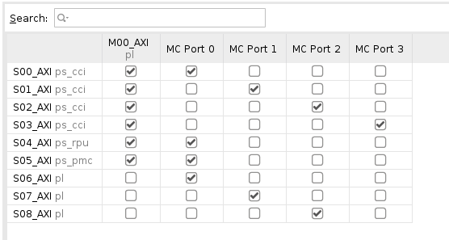

# Begin

When I tried to find the AXIDMA example design with Petalinux on Versal, I just cannot find one through the Internal. In my mind, this should be a quite straightforward design and just a piece of cake. As digging deeper, it turned out the design is quite complicated, especially on the software side. It might because that I am not a software engineer. The whole DMA driver start making me confuse after considering the multi-threads, cache coherence, kernel memory management.  Anyway, it's a nice journey to learn something new. 
 
 
# Circumstance 

* Vitis 2022.1 
* Petalinux 2022.1
* VCK190 Production Board

# HW design

create the hardware design is quite simple. After setting up your Linux environment, you could execute following command to re-build the HW design and generate the XSA file for Petalinux building. 

	$cd hw
	$vivado -source run.tcl
	
Above command could create BD design and generate post implemented XSA and include the PDI needed for Petalinux creating.

There are some tricks you should pay attention to if you are interested in. 

	
  
Click to expand for more details

	
  ## BD design Details
  1. AXI_DMA IP

It is necessary to understand all the interfaces definition of this IP before you use it. luckily, you could go to check the PG021 to understand the details of this IP. After that, you should understand why the BD design was created in this way. 
  
  2. BD IP connection
  
BD design is quite simple. The ILA has been inserted for HW debugging to monitor the 3 AXI memory map and 1 AXI stream interfaces activity. This mainly used to make sure the hardware behavior is consistent with expectation and further prove DMA is working beside the driver printing out. 

  
  3. NOC connectivity
  
NOC connectivity is new and important. At the beginning, the DAM failed is because of the wrong connectivity setting. You need to make sure the 3 AXI memory-map interfaces connected to DDR memory. Otherwise, the DMA engine cannot move the data or descriptor from the DDR memory, then the DMA will be failed. In this design, the S06_AXI, S07__AXI and S08_AXI are all coming from DMA engine, and all are connected to MC ports. 

	

# SW Design Steps

## Pre-requisite 

Beside the Petalinux installation, you also need the VCK190 BSP file, xilinx-vck190-v2022.1-final.bsp. You could setup the environment variable "BSP_FILE" to point to the path of BSP file.

	
## Build Petalinux Linux from VCK190 BSP

	$cd peta
	$make all
	
The petalinux build flow is quite long but the provided Makefile make it easier to complete the whole building process automatically. You could go through the Makefile to understand all the tricks there. 

There are few things need to be highlighted as following. 

## Enable drivers in kernel

axidmatest is a kernel code which will test the axi_dma performance during the system boot up. Like all the other Linux kernel drivers, they need a corresponding node in the device tree to trigger the execution of the code during the boot up. Otherwise, the code will not be executed although you have enabled it in the kernel configuration
	
## Add node into the device tree

The dtsi file has been provided and will be copy to the following path to enable axidmatest node in the device tree. 
	
	$vim ./project-spec/meta-user/recipes-bsp/device-tree/files/system-user.dtsi

		/include/ "system-conf.dtsi"
	/ {

			axidmatest_0: axidmatest@0 {
								 compatible ="xlnx,axi-dma-test-1.00.a";
								 dmas = <&axi_dma_0 0 &axi_dma_0 1>;
								 dma-names = "axidma0", "axidma1";
			} ;

	};

	&amba {
			zyxclmm_drm {
					compatible = "xlnx,zocl-versal";
			};
	};

	
## Review Device Tree

After the Petalinux building, it's a good idea to verify the current device tree file has already included the axidmatest node. But the system.dtb is not readable. So, we will leverage other tools to make it readable. 
	
	$cd AXI_DMA/images/linux/
	$dtc -I dtb -O dts -o system.dts system.dtb	
	$vi system.dts
	
In this way, we could review the system.dts to make sure you could find the following node in system.dts

    axidmatest@0 {
        compatible = "xlnx,axi-dma-test-1.00.a";
        dmas = <0x10 0x00 0x10 0x01>;
        dma-names = "axidma0\0axidma1";
        phandle = <0x58>;
	};

## Enable the drivers in the Petalinux kernel configuration

In this Petalinux release, the axi_dma driver has already been enabled by default. so, we do not need to enable it again. But the axidmatest driver has not been enabled. Since we are going to use it directly as part of kernel, not a kernel driver module, we need to change the kernel config file. 

one way is to use following command to configure kernel parameters through a GUI interface. 

	$petalinux-config -c kernel
	
But another way is to add the switch directly to the bsp.cfg file. You could find following command in the Makefile

	#	Apply config for kernel to enable axidmatest
	echo 'CONFIG_XILINX_DMATEST=y' >> ./AXI_DMA/project-spec/meta-user/recipes-kernel/linux/linux-xlnx/bsp.cfg
	
	

# Boot up Petalinux on VCK190 through JTAG

Finally, we could go to the hardware testing after you passed the Petalinux building successfully. Make sure you have powered on the VCK190 and connected the USB to your workstation or server. Then, we are going to download all the binaries through the JTAG. 

## JTAG configuration

	$cd peta/AXI_DMA/images/linux
	$xsdb
	xsdb%connect
	xsdb%ta 1
	xsdb%device program BOOT.BIN
	xsdb%dow -data -force "Image" 0x00200000 
	xsdb%dow -data -force "system.dtb" 0x00001000   
	xsdb%dow -data -force "rootfs.cpio.gz.u-boot" 0x04000000

	
## Setup the Vivado ILA through HW manager

This step is optional for the testing procedure. But it will definitely help you to understand what has happened in the hardware world. You could leverage HW manager to setup the trigger to capture the AXI transactions happening in different AXI lite,  AXI MM interfaces, and AXI stream interfaces, and how data have been moved around DDR and AXI stream interfaces. 

## UART

After connected your workstation to the VCK190, you should see the /dev/ttyUSB1 to /dev/ttyUSB3. Normally, the first one is connected to Versal UART. After the BOOT.BIN has been loaded successfully, you should see UART enter the u-boot with Versal prompt as following. 

Use following command to boot up Petalinux directly from DDR

	Versal>booti 0x00200000 0x04000000 0x00001000	

# Review On Petalinux 

After the Petalinux boot up successfully, we could check some configuration as following. But if you eager to see the results, you could directly jump to next section. 
	
## Review the DMA devices on Petalinux

Firstly, using following command to make sure the DMA device has been detected. In following command, the first two devices are axi_dma devices. We did not enable the multi-channels and one for TX and another for RX direction.

	root@xilinx-vck190-20221:/sys/module# ls -l /sys/class/dma
	total 0
	lrwxrwxrwx    1 root     root             0 Jan 19 00:57 dma0chan0 -> ../../devices/platform/amba_pl@0/20100000000.dma/dma/dma0chan0
	lrwxrwxrwx    1 root     root             0 Jan 19 00:57 dma0chan1 -> ../../devices/platform/amba_pl@0/20100000000.dma/dma/dma0chan1
	lrwxrwxrwx    1 root     root             0 Jan 19 00:57 dma1chan0 -> ../../devices/platform/axi/ffa80000.dma/dma/dma1chan0
	lrwxrwxrwx    1 root     root             0 Jan 19 00:57 dma2chan0 -> ../../devices/platform/axi/ffa90000.dma/dma/dma2chan0
	lrwxrwxrwx    1 root     root             0 Jan 19 00:57 dma3chan0 -> ../../devices/platform/axi/ffaa0000.dma/dma/dma3chan0
	lrwxrwxrwx    1 root     root             0 Jan 19 00:57 dma4chan0 -> ../../devices/platform/axi/ffab0000.dma/dma/dma4chan0
	lrwxrwxrwx    1 root     root             0 Jan 19 00:57 dma5chan0 -> ../../devices/platform/axi/ffac0000.dma/dma/dma5chan0
	lrwxrwxrwx    1 root     root             0 Jan 19 00:57 dma6chan0 -> ../../devices/platform/axi/ffad0000.dma/dma/dma6chan0
	lrwxrwxrwx    1 root     root             0 Jan 19 00:57 dma7chan0 -> ../../devices/platform/axi/ffae0000.dma/dma/dma7chan0
	lrwxrwxrwx    1 root     root             0 Jan 19 00:57 dma8chan0 -> ../../devices/platform/axi/ffaf0000.dma/dma/dma8chan0

## review the kernel driver has already included in Kernel 

Secondly, we could check if the axidmatest driver has already included in the kernel. If you could see /sys/module/axidmatest, that means you have enabled this module successfully in Petalinux kernel configuration.

root@xilinx-vck190-20221:/sys/module/axidmatest# ls -l /sys/module/axidmatest
total 0
drwxr-xr-x    2 root     root             0 Jan 19 00:59 parameters
--w-------    1 root     root          4096 Jan 19 00:57 uevent

# Observe the testing results	

Finally, we could check if everything working as we expected. Since we have not user application to run, we need to use different way to check the print out message from kernel. 

## axidmatest print out message

leveraging following command to get driver print out messages. You may notice that the driver has detected DMA engine successfully and there is a performance testing results. if you want to tune the DMA performance, you have not change the axidmatest.c to modify parameters. But the details will be not covered here. 

	root@xilinx-vck190-20221:~# dmesg |grep dma
	[    7.021297] xilinx-vdma 20100000000.dma: Xilinx AXI DMA Engine Driver Probed!!
	[    7.028732] xilinx-zynqmp-dma ffa80000.dma: ZynqMP DMA driver Probe success
	[    7.035860] xilinx-zynqmp-dma ffa90000.dma: ZynqMP DMA driver Probe success
	[    7.042985] xilinx-zynqmp-dma ffaa0000.dma: ZynqMP DMA driver Probe success
	[    7.050111] xilinx-zynqmp-dma ffab0000.dma: ZynqMP DMA driver Probe success
	[    7.057238] xilinx-zynqmp-dma ffac0000.dma: ZynqMP DMA driver Probe success
	[    7.064367] xilinx-zynqmp-dma ffad0000.dma: ZynqMP DMA driver Probe success
	[    7.071492] xilinx-zynqmp-dma ffae0000.dma: ZynqMP DMA driver Probe success
	[    7.078614] xilinx-zynqmp-dma ffaf0000.dma: ZynqMP DMA driver Probe success
	[    7.383332] dmatest: Started 1 threads using dma0chan0 dma0chan1
	[    7.401019] dma0chan0-dma0c: terminating after 5 tests, 0 failures 705 iops 49661 KB/s (status 0)
	root@xilinx-vck190-20221:~# 

	
## ILA capture for hardware waveform

The ILA should have capture the AXI data like following waveform. 

# Before closing

## Understand more about drivers

I was quite surprised when I tried to understand the drivers. From hardware prospect, the DMA feature is very straightforward, just moving data from one address to another. You only need to configure few registers to enable this DMA engine. But in software driver world, there are lots of things need to take care. 

### Why SG(Scatter Gather) is needed ?

If we could always get a huge continue physical memory, we don't need SG feature. You could reserve a block of memory and make it only available for DMA engine. But it's quite difficult to get a huge continue physical memory for DMA engine under Petalinux managed memory. We could only get a limited pieces of memory at each time, and we can't guarantee kernel could give you continue memory space. So, the SG feature has become a must-have feature in modern Petalinux. 

DMA driver have different layers. The axidmatest.c is upper layer to test DMA engine performance based on DMA drivers. Here is the note to understand more. 

xilinx_dma.c is the lower level of driver. It provided the methods and functions for other kernel modules. 

## Performance Optimization

This is an interesting topic. The knowledge of HW and also SW is necessary to see where the bottleneck is and how to improve the system efficiency. 

Here are some pointers but I don't want to expand on those topics:
* AXI Burst Length
* DMA length
* DMA engine working frequency and AXI bus width
* Number of DMA engines
* Polling mode or interrupt mode

